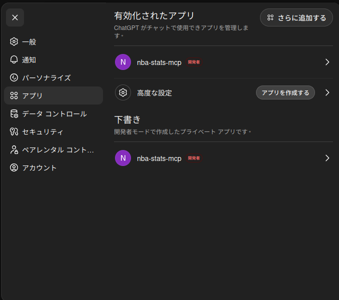
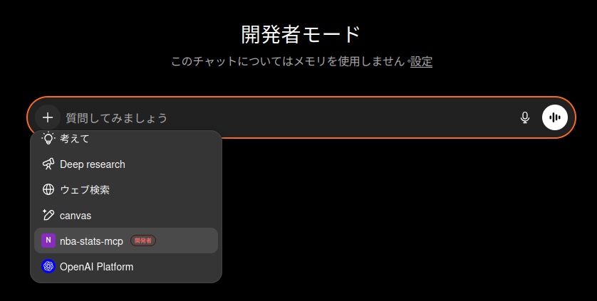

# chatgptで始める

1. [Webページ](https://chatgpt.com)にアクセスする

2. 開発者モードをOnにする

[公式ガイド](https://help.openai.com/ja-jp/articles/12584461-developer-mode-and-mcp-apps-in-chatgpt-beta)

3. 「設定 > アプリ」から「アプリを作成する」を選択

4. 以下を入力

名前：nba-stats-mcp (好きな名前でOK)
MCP サーバーの URL: https://nba-stats-mcp.poteto-mahiro.com/
認証：認証なし

5. チャットの「+」からmcpを選択(必要ない可能性あり)

